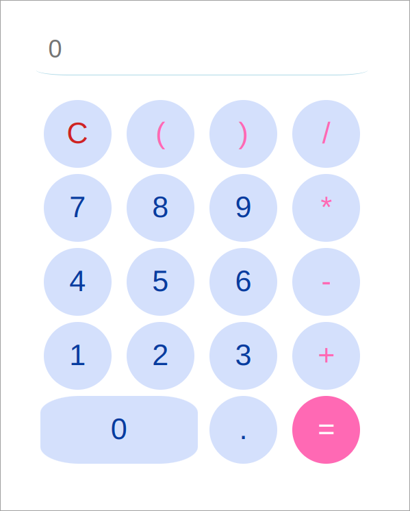

# Simple Calculator App

This is a simple calculator app built using React. The app allows users to perform basic arithmetic operations such as addition, subtraction, multiplication, and division.

## Features
Addition, subtraction, multiplication, and division operations.
Clear button (C) to reset the input.
Equal button (=) to calculate the result.
Input field to display the current result and history of actions.

## Screenshots
